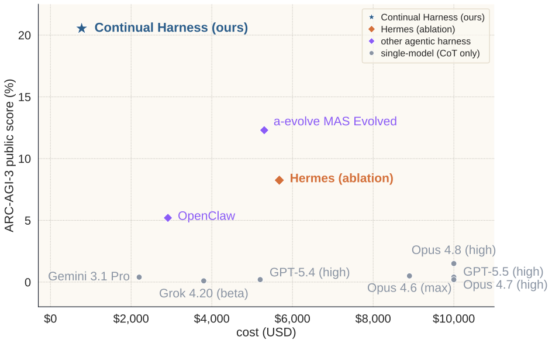
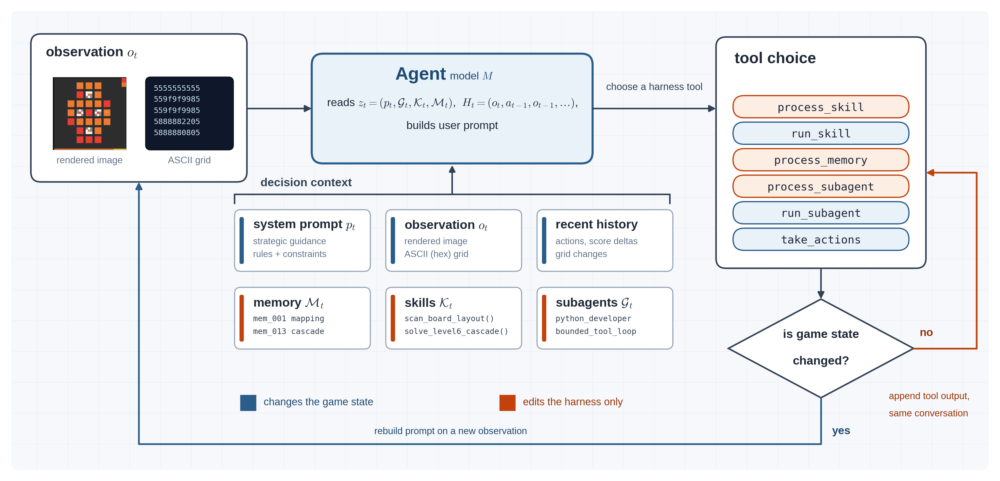
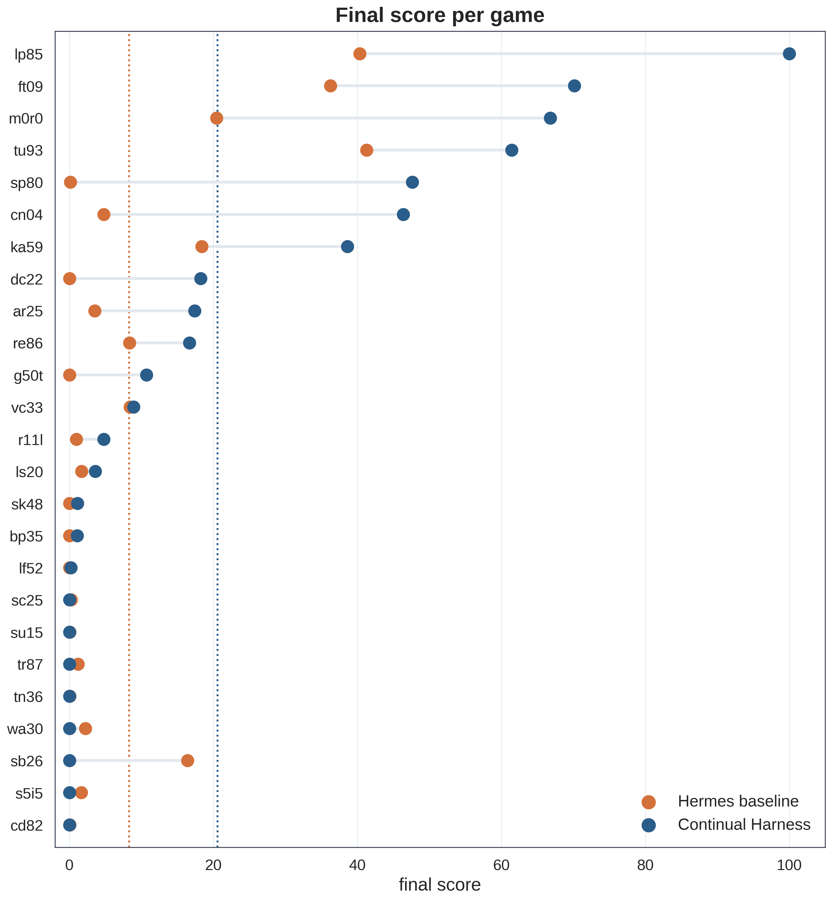
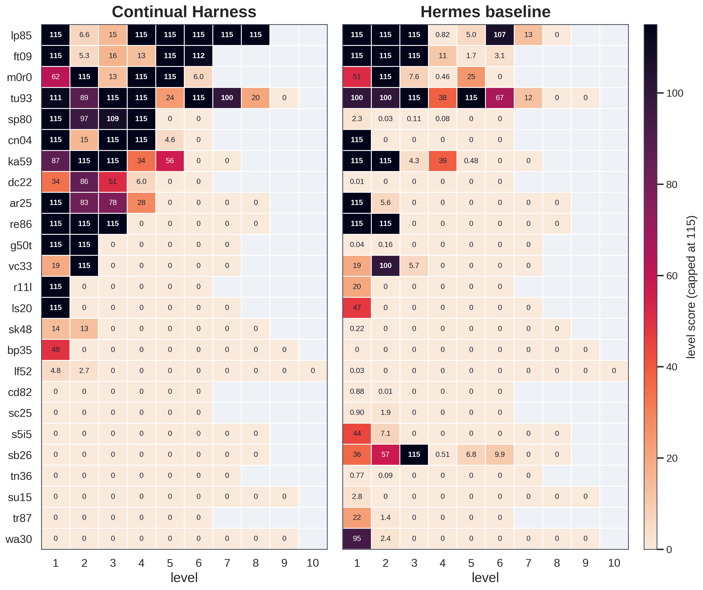
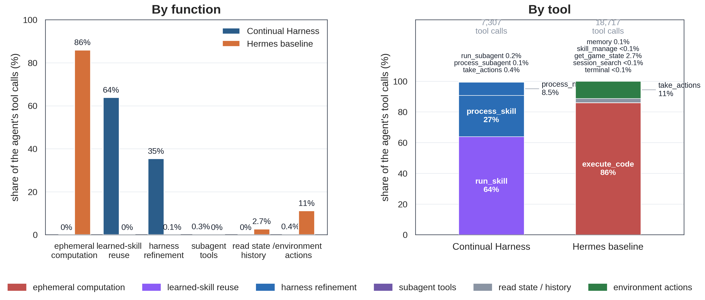

# Continual Harness: An Efficient Self-Improving Agent on ARC-AGI-3

<p class="authors">Ruirong Feng, Seth Karten, Wenzhe Li, Chengshuai Shi, Chi Jin</p>
<p class="affiliation">Princeton University</p>

<div class="btn-row">
<a class="btn" href="https://arxiv.org/abs/2605.09998">Original Paper</a>
<a class="btn" href="https://github.com/feng-rrRay/Continual-Harness-ARC-AGI-3/">Code</a>
<a class="btn" href="https://arcprize.org/scorecards/ac3eeaf5-6ace-4d2d-bf29-9469fd00a57b">Scorecard</a>
</div>

---
ARC-AGI-3 is an IQ test for agents. The heavy test-time learning required by the benchmark pushes agents to form an internal world model of the rules and mechanics that updates with new evidence. Last month, we finalized a version of Continual Harness that addresses this problem through persistent state and harness self-improvement.

Continual Harness is a reset-free, self-improving agentic harness that enables a foundation model to store memories, write reusable skills, deploy subagents, and refine its own prompt during interactive tasks. In our previous evaluations on Pokémon Red and Emerald, Continual Harness started with no prior memory, hand-crafted tools, or domain-specific scaffolding, and completed early-to-mid milestones of both games with comparative efficiency to the hand-crafted harness. 

ARC-AGI-3 asks two further questions:
```markdown
1. Can Continual Harness discover hidden rules in games designed to be unknown at test time?
2. Which part of Continual Harness contributes most to its long-horizon progress? 
```

We study these questions on the public set of ARC-AGI-3, which contains 25 unknown games in a shared environment. Each game is designed to hide its rules, mechanics and scoring method, so an agent cannot rely on human-engineered task descriptions or domain-specific tools. This creates a hard setting for current LLM agents and frontier models. As of Jun 30 2026, the best frontier model `Claude Opus 4.8 (high)` on the [verified leaderboard](https://arcprize.org/leaderboard) only reached 1.5%, and the officially released OpenClaw harness with `Claude Opus 4.7` only reached 5.2%.

Starting from minimal information about the game environment (without even a color legend for the ASCII map) and using strictly sandboxed code execution, Continual Harness scored 20.54% with a total cost of only $774. The result makes it one of the most efficient agentic harnesses on the leaderboard. To better understand where the gain comes from, we additionally implemented a Hermes-based harness with comparable prompts and settings.

Here are our key findings (TL;DR):

- **Continual Harness generalizes by improving a world model at test time.** Continual Harness turns interaction history into a live surrogate state of system prompt, memory, skills, and subagents. These components behave like an editable world model where the harness stores and refines its understanding of the game dynamics.  
- **The efficiency of Continual Harness comes from skill reusing.** Across 25 games, 62% of Continual Harness's executed actions come from saved skills. Allowing later decisions to reuse and improve on a tested routine avoids recurring exploration and computation.  
- **Reset-free refinement allows the model to bootstrap from early exploration.** The Refiner of Continual Harness is an external VLM call that rereads raw trajectories, verifies and consolidates the learned mechanics, and updates the system prompt, memories, skills, and subagents without restarting the run. This turns noisy trial-and-error into a cleaner world model for later levels. The next step is to impose stronger evidence auditing for better self-refinement quality.



<div data-embed="replay-top"></div>

## Architecture

Following the architecture introduced in our original paper (arXiv: 2605.09998), Continual Harness consists of four editable components (system prompt \(p\), sub-agents \(\mathcal{G}\), skills \(\mathcal{K}\), and memory \(\mathcal{M}\)) plus an automated Refiner that rewrites \(p, \mathcal{G}, \mathcal{K}, \mathcal{M}\) in place from trajectory analysis. The four components serve distinct roles:
- The **system prompt \(p\)** is a text state encoding the agent's current strategy, including active hypotheses, planned experiments, optimal tool usage, and known failure modes. 
- **Memory \(\mathcal{M}\)** stores persistent facts and candidate rules. 
- **Skills \(\mathcal{K}\)** are reusable Python routines that run sandboxed on the current observation and either emit actions or return structured results. 
- **Subagents \(\mathcal{G}\)** handle specialized multi-step subtasks in isolated contexts.
The orchestrator edits these components through CRUD-style tool calls: `process_skill`, `process_memory`, and `process_subagent`; The remaining execution tools are `take_actions`, `run_skill`, and `run_subagent`.

When the weight of the foundation model is frozen, Continual Harness makes continual learning possible by using its four editable components as an external world model. At each step \(t\), Continual Harness adaptively maps the interaction history \(H_t = (o_1, a_1, o_2, a_2, \ldots, o_t)\) into an editable surrogate state \(z_t = (p_t, \mathcal{G}_t, \mathcal{K}_t, \mathcal{M}_t)\). The surrogate state stores the agent's current understanding of the game. The orchestrator then acts by conditioning the foundation model \(\theta_{\mathrm{FM}}\) on both the current observation and the learned surrogate world model:
\[
    a_t \sim \pi_{\theta_{\mathrm{FM}}}(\cdot \mid o_t, z_t).
\]

At each game-state boundary, the orchestrator assembles its decision context from the system prompt \(p_t\), the current observation, recent interaction history, and an overview of available memory entries, skills, and subagents. The current observation contains both an ASCII grid and a rendered image. For multi-grid frames, we include the first and last grids when they differ; otherwise, we select key animation frames that summarize the transition. The orchestrator then chooses among `process_skill`, `run_skill`, `process_memory`, `process_subagent`, `run_subagent`, and `take_actions`.

For ARC-AGI-3, we made three changes to improve tool use and exploration. 

First, we changed when the user prompt is rebuilt. The prompt is now fully resembled only after tool calls that can change the game state: `take_actions`, `run_subagent`, and action-firing `run_skill`. Tool calls that only edit the harness state or perform analysis (`process_skill`, `process_memory`, `process_subagent`, and non-action-firing `run_skill`) do not trigger a full prompt rebuild. Their outputs are appended to the ongoing conversation until the next game-state-changing action occurs. This preserves the local reasoning chain across internal edits and analysis calls.



Second, we trigger the Refiner after game-over and level-up events, in addition to the periodic refining loop that runs every \(F\) steps.

Third, we add a `confidence` field to each memory entry, where `1 = untested guess, 2 = weak evidence, 3 = unverified inference, 4 = confirmed once, 5 = repeatedly confirmed`. The extra field helps preserve speculative rules and reduce the risk that hallucinated or weakly supported claims dominate future decisions.

<div data-embed="prompt-loop"></div>

## Experimental setup

We evaluate Continual Harness and Hermes on 25 public games of ARC-AGI-3 using the same foundation model `gemini-3.1-pro-preview` and matched environmental interfaces. All games run once in `online` mode without cherry-picking or prior information to the agent.

Continual Harness follows the architecture described above. Each game stops when per-level actions exceed \(5\times\) the human baseline, total actions exceed 5,000, or session cost exceeds $100.
Hermes agent runs inside a Docker container and interacts with the ARC-AGI-3 environment through an MCP game server exposing only `get_game_state` and `take_actions`. Hermes retains its built-in tools for code execution, file access, memory, skills, and session search, and uses a stopping threshold of 10,000 actions.
Neither agent has access to game rules, source code, the scoring method, environment files, or any task-specific privileged information.

We use Hermes as an additional baseline because it also focuses on updating skills over an agent's session. Hermes shares the same model and environment interface as Continual Harness, so the comparison is more controlled than to other leaderboard harnesses. Community leaderboard entries are reported as external reference points.

## Results

Continual Harness scored 20.54% on the public set of ARC-AGI-3 at a cost of $774. The result outperforms the controlled Hermes baseline (8.25% at $5,674), the public OpenClaw reference point (5.20% at $2,912), and the `A-Evolve MAS Evolved` agent (12.30% at $5,300). 

The main source of Continual Harness’s score advantage comes from action efficiency. It completes levels by discovering workable mechanics early and reusing those mechanics on later levels. Compared with Hermes, Continual Harness completed fewer levels overall (64 vs. 70) but achieved more than twice the final score. The per-level comparison shows that Continual Harness averages only 1.48x the human baseline actions on completed levels while Hermes averages 15.30x. On its strongest games (`lp85`, `ft09`, `m0r0`, `tu93`), Continual Harness follows a pattern that it spends the first few levels exploring the game dynamics and clears later levels with nearly full scores. 





The broader leaderboard comparison reveals the advantage of Continual Harness’s persistent state and self-improving design. OpenClaw gives the model a persistent scratchpad through memory and file tools, but its state remains mostly textual and does not become executable skills or subagents. `A-Evolve` also improves the agent’s workspace across cycles, but with a heavy solve-evolve-reload workflow that results in a higher reported cost.

We then look inside the successful runs to understand where Continual Harness gets its efficiency. We find two design choices that explain most of the gain: reusable skills turn discovered mechanics into efficient execution routines, and reset-free refinement improves the harness's world model as trajectories grow longer.


### **Reusable skills turn discovery into efficient execution**

Continual Harness gains efficiency because useful computation becomes part of the harness state instead of remaining scratch work. Across 25 games, 62% of the executed actions originate from saved skills rather than fresh VLM deliberation. This share exceeds 80% on the harness’s top-performing games such as `cn04` and `ft09`. In terms of tool use distribution, 64% of Continual Harness’s tool calls replay learned skills and 35% create or edit skills and memory.

The Hermes baseline provides an example where useful computation stays transient. Hermes spends 86% of its 18,717 tool calls on `execute_code`, and only 0.07% on persisting skills or memory. Useful scripts such as BFS solvers, grid parsers, and state trackers are repeatedly written as one-off code. 




### **Reset-free refinement improves the world model**

Reset-free refinement explains why late levels become the primary source of Continual Harness's score gain. After a level-up, game-over or stagnation point, the refiner rereads the raw trajectory, identifies observations that reveal stable game mechanics, and consolidates the learned mechanics into the live decision context. All four components of the surrogate state (system prompt, skills, memory, and subagents) are jointly refined, so that corrected abstractions propagate into execution routines, and the harness assembles a self-contained world model from scattered evidence.

<div data-embed="refinement-lift"></div>

The `lp85` and `cn04` traces show how reset-free refinement improves the internal world model of the harness. In `lp85`, the game progress is driven by harness refinements at game-over and stagnation points. The memory entries are mainly created by the Refiner at the early stage, suggesting that the game mechanics are primarily learned by rereading the trajectory. As the harness gathers a more computable rule model, skill operations gradually shift from exploration toward exploitation, so that later levels are cleared with much smaller action budgets.

<div data-embed="lp85-policy"></div>

<div data-embed="replay-lp85"></div>

In `cn04`, refinement turns a partial early model into a precise rule that later levels can reuse directly. The memory curve shows steady accumulation of rule and mechanics across refinements, and the skill operations remain balanced between analysis, solver planning, and execution. The trace example shows how refinement converts trajectory evidence into lower-cost execution.

<div data-embed="cn04-behavior"></div>

<div data-embed="replay-cn04"></div>


## What's next

Continual Harness shows strong exploration and action efficiency on unknown interactive tasks such as Pokémon and ARC-AGI-3, but we don’t see it as the final form of self-improving agents. The next step is to make the refinement loop more reliable and less model-dependent. 

In long-horizon tasks, the internal world model of the harness is susceptible to misleading evidence. The Refiner needs better ways to audit evidence and decide which trajectory segments are worth turning into memory, skills, or prompt updates.

Another challenge is generality. Continual Harness works best with strong frontier models. We want to reduce that dependence from both sides. On the harness side, we want a more universal self-improving scaffold that can help weaker models without relying on model-specific behavior. On the model side, the goal is to train open-source models to use and improve the harness well over long horizons. 


## Acknowledgements

This blog builds on our original Continual Harness project. We thank all coauthors of the Continual Harness paper for their contributions, including Joel Zhang, Tersoo Upaa Jr., and Kiran Vodrahalli for their work on the original system. We also thank Google DeepMind for supporting this work with Gemini API credits.


## Citation

If you use Continual Harness in your work, please cite our original paper:

```bibtex
@article{karten2026continual,
  title={Continual Harness: Online Adaptation for Self-Improving Foundation Agents},
  author={Karten, Seth and Zhang, Joel and Upaa Jr, Tersoo and Feng, Ruirong and Li, Wenzhe and Shi, Chengshuai and Jin, Chi and Vodrahalli, Kiran},
  journal={arXiv preprint arXiv:2605.09998},
  year={2026}
}
```